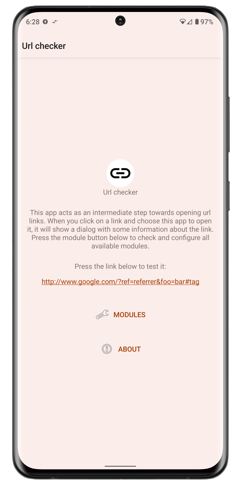
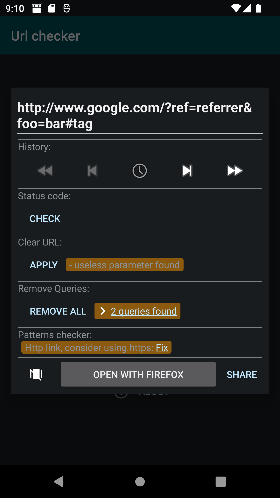
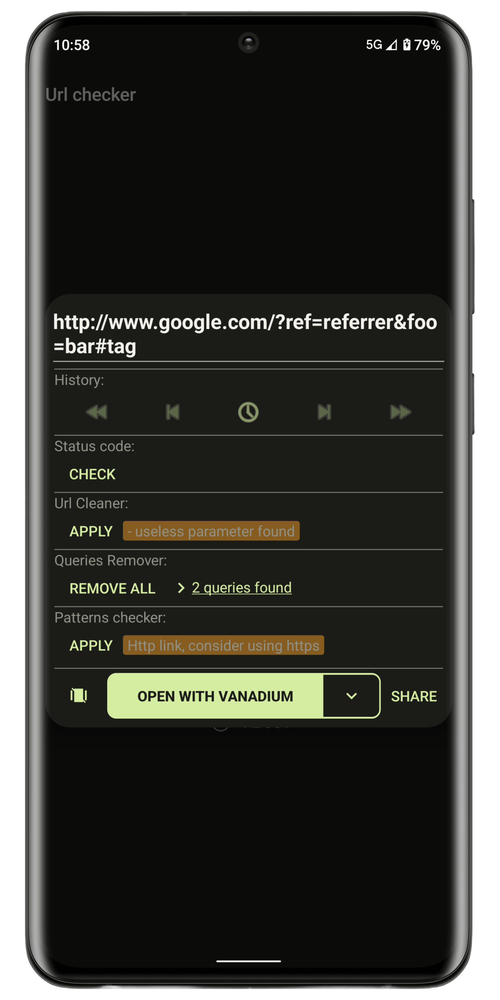
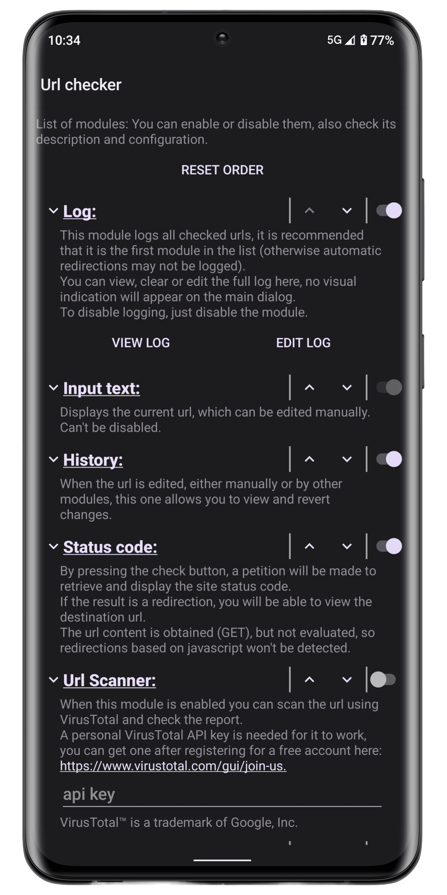
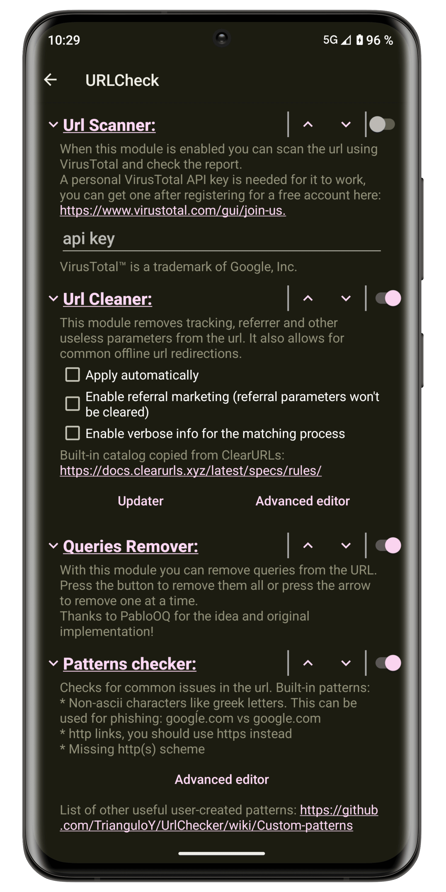
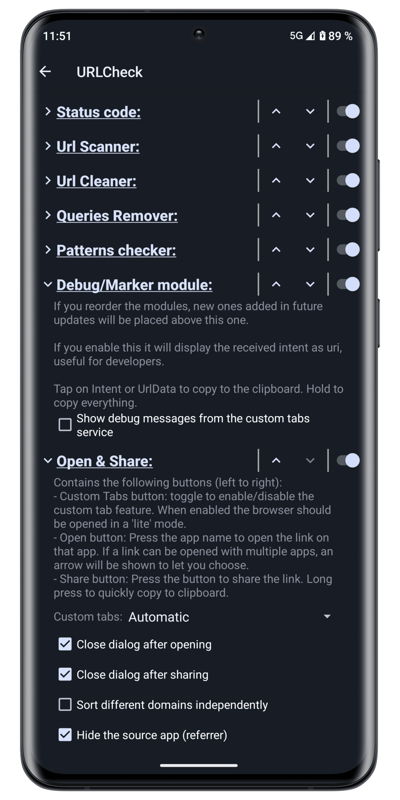
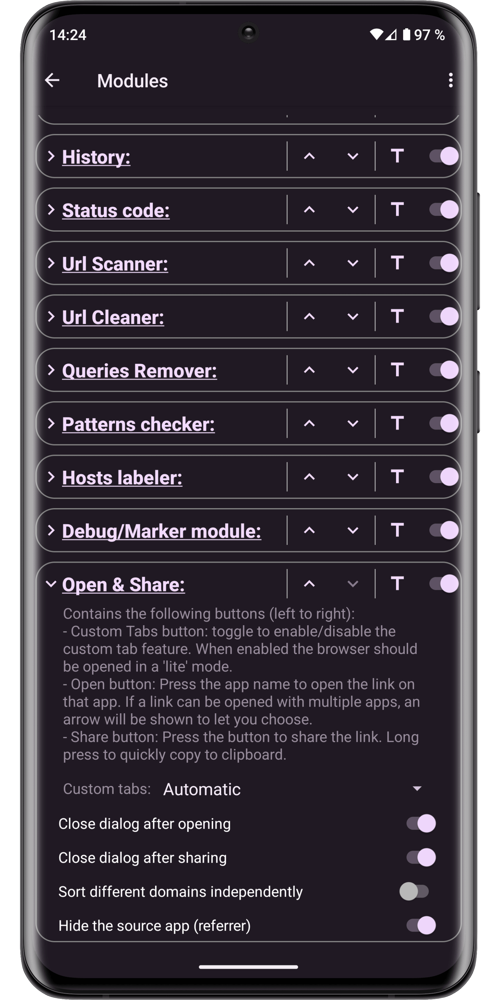
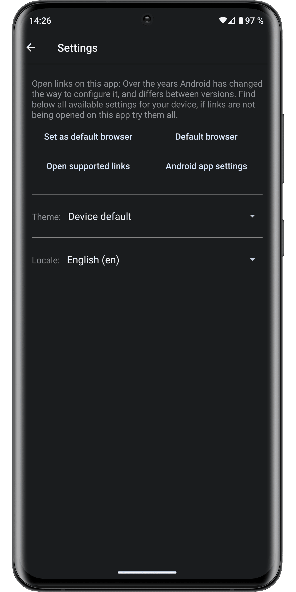

<!-- ---------- Header ---------- -->

<!-- Original background with CC0 from https://www.maxpixel.net/Digital-Network-Internet-Communication-Connections-3537400 -->

<!-- title -->

# URLCheck

<!-- ---------- Badges ---------- -->

<!-- ---------- Download ---------- -->

<!-- contributors -->

### Android app made by [TrianguloY](https://github.com/TrianguloY)

Special contributors: [Ilithy](https://github.com/Ilithy), [PabloOQ](https://github.com/PabloOQ), [anoop-b](https://github.com/anoop-b)

All contributors: \
 \
and [404potato](https://github.com/404potato) and maybe some more from [Weblate](https://hosted.weblate.org/engage/urlcheck/).

<!-- ---------- Description ---------- -->
**URLCheck** acts as an amazingly customizable and powerful intermediary when opening url links, allowing, among other things:
to remove trackers, affiliate links, unnecessary elements, check Hosts, facilitating link holding and sharing, protecting against certain phishing techniques and many more...

<!-- ---------- Screenshots ---------- -->

  
  
  
  
  
  
  
  

<!-- ---------- Contribution & contributors ---------- -->

## Contribution

**All help is greatly welcomed!**  
Feel free to [**suggest changes**](https://github.com/TrianguloY/UrlChecker/issues/new), request a [**new feature**](https://github.com/TrianguloY/UrlChecker/issues/new?assignees=&labels=enhancement&template=feature_request.md&title=), create [**bug report**](https://github.com/TrianguloY/UrlChecker/issues/new?assignees=&labels=bug&template=bug_report.md&title=) or even [**pull request**](https://help.github.com/articles/about-pull-requests/). _(from a simple typo fix to a full new module or even more!)_  
**Translations are also greatly appreciated.**

See [CONTRIBUTING](docs/CONTRIBUTING.md) for code or translation details and tips.

<!-- ---------- License ---------- -->

## License

You can use parts of this project in your own ones, or upload modified versions of it AS LONG AS you credit me.

**How to credit:**

- You must add my nick [**TrianguloY**](https://github.com/TrianguloY/) in an `about` or `acknowledgments` section visible to the user.
- You must add a link to this [**GitHub main page**](https://github.com/TrianguloY/UrlChecker) or subpage (if you used a part of the code or an asset) in an `about` or `acknowledgments` section visible to the user.
