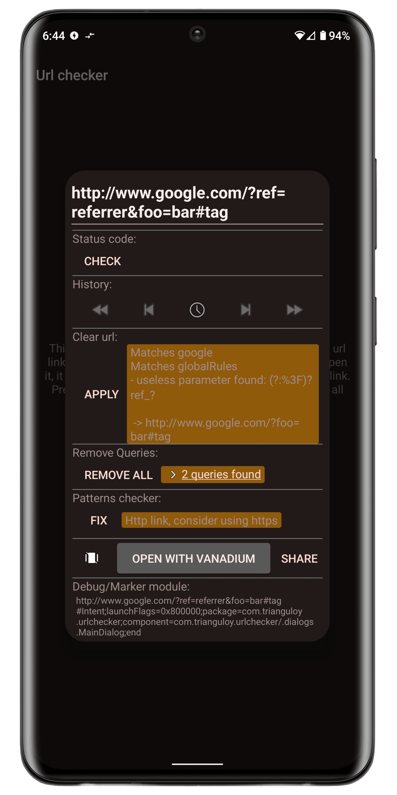
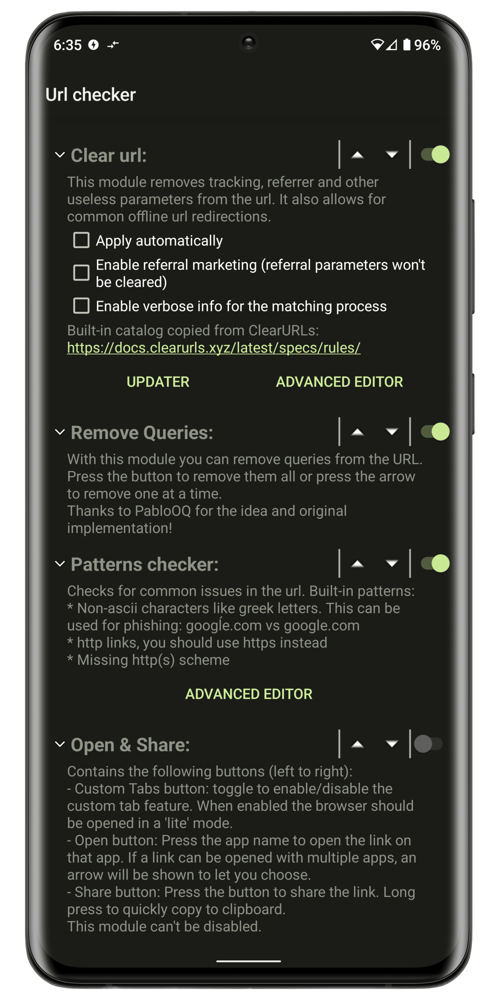

## Url Checker

### Android app made by TrianguloY

[**Url Checker**](https://f-droid.org/en/packages/com.trianguloy.urlchecker/) acts as an intermediary when opening url links, allowing, among other things:  
to remove trackers, affiliate links, unnecessary elements,  
facilitating link sharing, protecting against certain phishing techniques and many more...

 
 
 

## Download

 

### Contribution

All help is welcomed! Feel free to suggest changes, create issues or even pull requests (from a simple typo fix to a full new module or even more!)

I don't have a coding style, but try to keep it similar to mine, with just a couple notes:

- Please write comments. No need to write full paragraphs each line, but at least a minor comment for functions and non-obvious blocks of code really help.
- Try to make small commits, when possible, I'll need to review you changes manually so help me understand it.

## License

    
You can use parts of this project in your own ones, or upload modified versions of it AS LONG AS you credit me.

**How to credit:**

- You must add my nick [TrianguloY](https://github.com/TrianguloY/UrlChecker) in an `about` or `acknowledgments` section visible to the user.
- You must add a link to this GitHub main page **https://github.com/TrianguloY/UrlChecker** or subpage (if you used a part of the code or an asset) in an `about` or `acknowledgments` section visible to the user.
